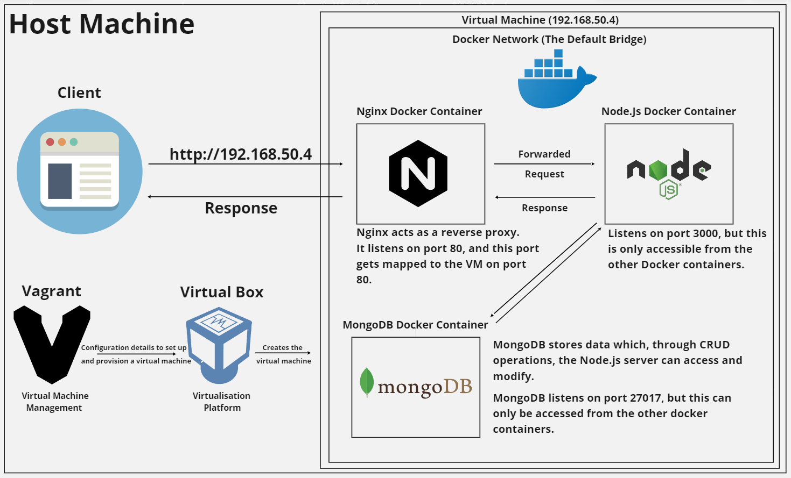

# Using this Repository

To use this repository, you will need to install Vagrant 2.3.0 (click [here](https://www.vagrantup.com/downloads)) and VirtualBox (click [here](https://www.virtualbox.org/)). Then clone this repository and run `vagrant up` in the folder which contains the `Vagrantfile`. If you encounter a problem with running `vagrant up` and you are using the Windows OS, try [this potential solution](https://github.com/samuel-walters/docker-three-tier-architecture/blob/main/documentation/Blockers.md) which deals with the Hyper-V blocker.

# Project Overview

## Docker Network Used in this Project

When you start Docker, a default bridge network (also called bridge) is created automatically, and newly-started containers connect to it unless otherwise specified. 

While the default bridge allows the containers to communicate with one another, it will not grant someone the ability to access them from outside the Docker Network. Therefore, it is impossible to directly connect with the MongoDB and the Node.js Docker containers in this project if you are outside the network. Only the Nginx Docker container can be accessed from the outside because its port has been mapped to the virtual machine on port 80. This of course is useful for security since access to databases like MongoDB can be restricted.

# What is a Reverse Proxy?

A reverse proxy is a server that sits in front of web servers and forwards clients (i.e.g. web browsers) requests to those web servers. In this project, Nginx sits in front of the Node.Js server, forwarding requests to it and returning the response to the client. 

# Why use a Reverse Proxy?

## Load Balancing

A reverse proxy can provide a load balancing solution which will distribute the incoming traffic evenly among the different servers to prevent any single server from becoming overloaded. In the event that a server fails completely, other servers can step up to handle the traffic.

## Protection from Attacks 

Since a reverse proxy acts as a "middleman", a web site or service never needs to reveal the IP address(es) of their origin server(s). This makes it much harder for attackers to leverage a targeted attack against them, such as a DDoS (Distributed Denial of Service) attack. Instead the attackers will only be able to target the reverse proxy which will have tighter security and more resources to fend off a cyber attack.

## Web Acceleration

Reverse proxies can compress inbound and outbound data, as well as cache commonly requested content, both of which speed up the flow of traffic between clients and servers. 

